# Azure Governance & Security Hardening: RBAC, Policy-as-Code & Cost Controls

A hands-on Azure lab demonstrating cloud governance fundamentals: enforcing least-privilege access with **Role-Based Access Control (RBAC)**, blocking non-compliant deployments with **Azure Policy**, and preventing budget overruns with **Cost Management alerts**. This project simulates a real-world scenario where an Administrator must restrict a Junior Developer's permissions and guardrail the environment against expensive mistakes.

---

## Table of Contents

- [Overview](#overview)
- [Why This Matters](#why-this-matters)
- [Architecture Diagram](#architecture-diagram)
- [Tech Stack](#tech-stack)
- [Prerequisites](#prerequisites)
- [Naming Conventions](#naming-conventions)
- [Walkthrough](#walkthrough)
  - [Phase 1: Resource Group Setup](#phase-1-resource-group-setup)
  - [Phase 2: RBAC Configuration](#phase-2-rbac-role-based-access-control)
  - [Phase 3: Access Verification](#phase-3-verify-access-the-access-denied-test)
  - [Phase 4: Azure Policy Enforcement](#phase-4-azure-policy-preventing-expensive-mistakes)
  - [Phase 5: Policy Validation Test](#phase-5-testing-the-policy)
  - [Phase 6: Cost Management Budget](#phase-6-cost-management-budgets)
- [Troubleshooting](#troubleshooting)
- [Cleanup](#cleanup)
- [Skills Demonstrated](#skills-demonstrated)
- [Future Enhancements](#future-enhancements)

---

## Overview

Most cloud environments start with a single Owner account that can do everything. That model doesn't scale and it doesn't survive an audit. This project walks through the shift from "one all-powerful account" to a governed environment with **layered controls**:

1. **Identity** — provision a new user in Microsoft Entra ID
2. **Access** — restrict that user to read-only via RBAC
3. **Guardrails** — use Azure Policy to block non-compliant resource deployments (even from privileged accounts)
4. **Cost Control** — set a budget with automated alerting before spend gets out of hand

Each control is tested end-to-end — not just configured, but verified to actually block the action it's designed to block.

## Why This Matters

This isn't just an access-control exercise — it's the foundation of cloud security posture management (CSPM) and a direct analog to what governs production environments in regulated and federal cloud environments:

- **RBAC** enforces least privilege, the first control any security review checks for.
- **Azure Policy** is governance-as-code — the same mechanism used to enforce tagging standards, restrict regions, mandate encryption, and block non-compliant SKUs at scale across hundreds of subscriptions.
- **Budgets & cost alerts** are a basic but critical FinOps control, especially relevant in environments where unmonitored compute can quietly turn into a five-figure bill.

## Architecture Diagram

.svg)

*The Admin applies RBAC, Policy, and Budget controls to the Resource Group. The Junior Developer's attempt to create a resource is blocked by RBAC (403 Access Denied), and an oversized VM deployment is blocked by Azure Policy (Validation Failed) — even when attempted by a privileged account. The Budget control monitors spend independently and fires an email alert at the 80% threshold.*

> 📌 **Note:** The diagram above is an SVG checked into `assets/architecture-diagram.svg`. Open it in any browser or image viewer, and feel free to rebuild it in draw.io / Lucidchart / Excalidraw if you want a different style — keep the relationships (Admin → Controls → Resource Group ← blocked attempts) the same.

## Tech Stack

| Category | Tools / Services |
|---|---|
| Cloud Provider | Microsoft Azure |
| Identity | Microsoft Entra ID (formerly Azure AD) |
| Access Control | Azure RBAC (Role-Based Access Control) |
| Governance | Azure Policy |
| Cost Management | Azure Budgets & Cost Alerts |
| Portal | Azure Portal |

## Prerequisites

- [ ] Active Azure subscription with Owner-level access
- [ ] Basic familiarity with the Azure Portal navigation
- [ ] Access to an Incognito/Private browser window (used to simulate a second user without logging out of the admin account)

## Naming Conventions

| Resource | Naming Pattern Used |
|---|---|
| Resource Group | `rg-lab05-gov-[yourname]` |
| Test User | `junior-dev-[yourname]` |
| Policy Assignment | `Restrict-VM-Sizes` |
| Budget | `Monthly-Lab-Budget` |

---

## Walkthrough

### Phase 1: Resource Group Setup

Created an isolated Resource Group to act as the "playground" for every control in this lab, scoped to **East US**. Keeping the blast radius limited to a single Resource Group means the Policy assignment in Phase 4 only affects this sandbox — not the entire subscription.

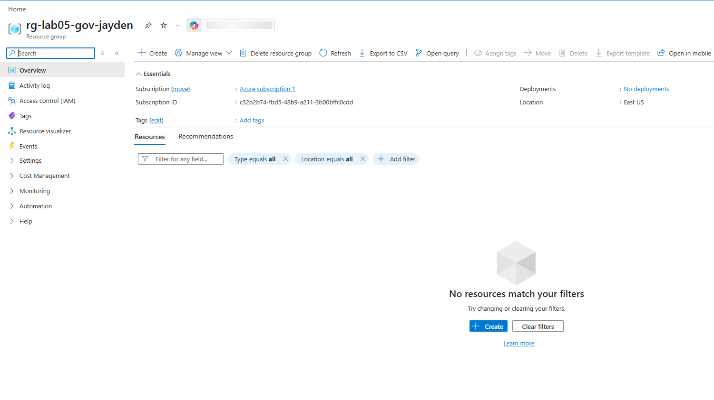
> Resource Group overview blade showing `rg-lab05-gov-[yourname]` successfully created in East US.

### Phase 2: RBAC (Role-Based Access Control)

Simulated onboarding a junior team member who should be able to **view** resources but never modify or create them.

1. Created a new user in **Microsoft Entra ID** (`junior-dev-[yourname]`).
2. Assigned the **Reader** role to that user, scoped specifically to the lab Resource Group via **Access control (IAM)**.

This is the least-privilege model in practice: access is granted at the narrowest scope necessary, not at the subscription level.

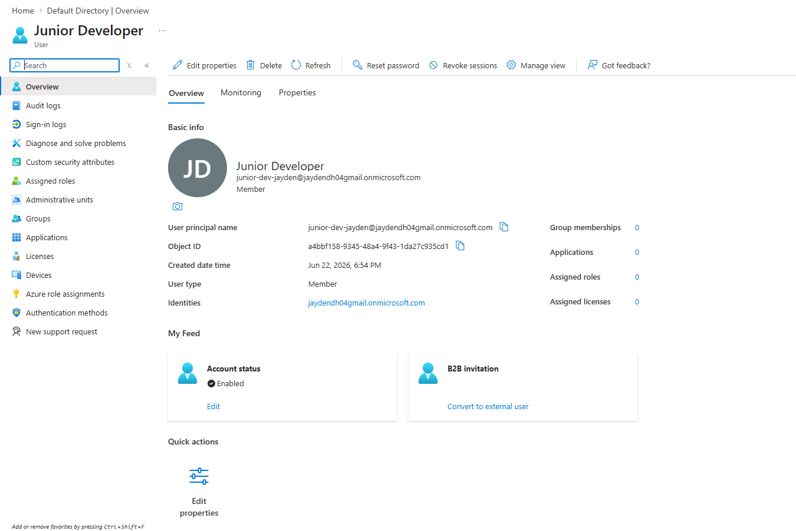
> Microsoft Entra ID "Create new user" blade with the username and display name filled in. *(Redact or blur the password field before committing.)*

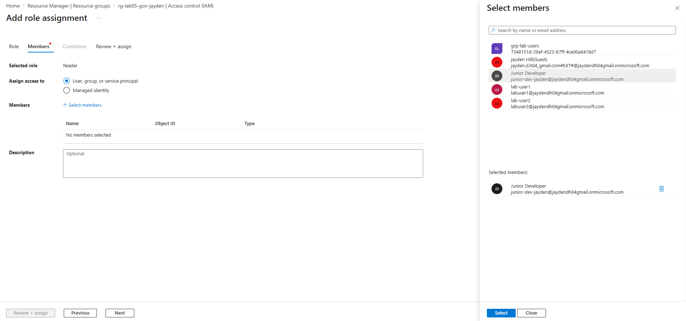
> Access control (IAM) → Add role assignment blade showing **Reader** selected as the role and the Junior Developer added as a member.

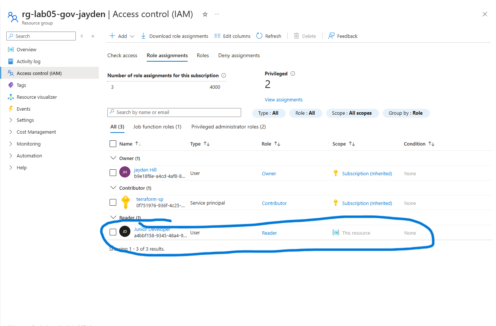
> IAM "Role assignments" tab confirming the Junior Developer now has the Reader role scoped to the Resource Group.

### Phase 3: Verify Access (The "Access Denied" Test)

Configuration without verification isn't governance — it's a guess. Logged in as `junior-dev-[yourname]` from a separate Incognito window and attempted to create a Storage Account inside the scoped Resource Group.

**Result:** Creation was blocked — validation failed and/or the Create button was disabled, confirming the Reader role correctly prevents write actions.

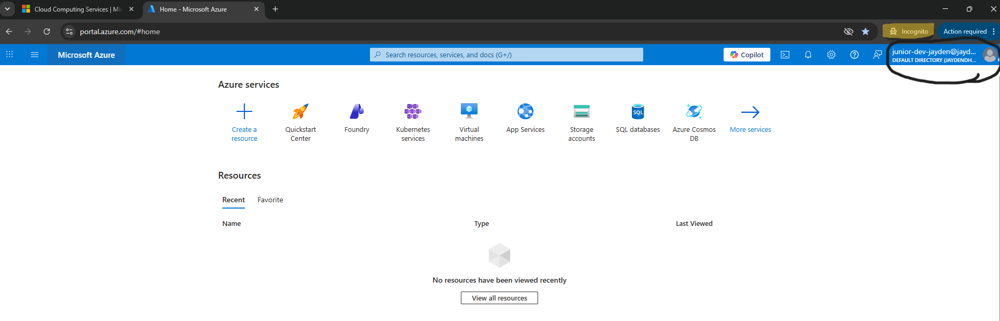
> Incognito browser window signed in as the junior-dev user, showing the Azure Portal home screen. *(Blur tenant/domain info if sharing publicly.)*

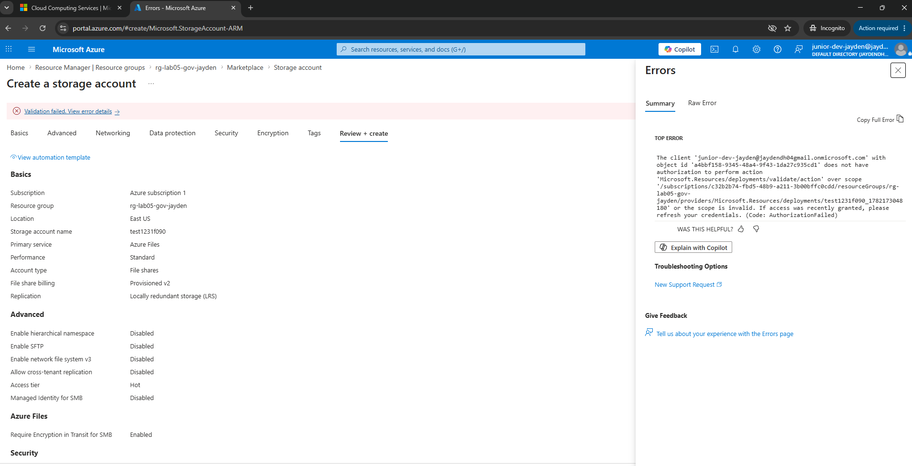
> The "you do not have authorization to perform this action" banner or greyed-out Create button when attempting to provision a Storage Account as the Reader-only user. **This is the single most important screenshot in the repo** — it's the visual proof the control works.

### Phase 4: Azure Policy (Preventing Expensive Mistakes)

Switched back to the Admin account to apply a guardrail that protects against costly deployments — one that applies even to privileged users, not just the Junior Developer.

- Assigned the built-in policy **"Allowed virtual machine size SKUs"**, scoped only to the lab Resource Group.
- Restricted the allowed SKUs to **Standard_B1s** and **Standard_B1ms** — small, cheap burstable sizes only.
- Named the assignment `Restrict-VM-Sizes`.

> ⏱️ Azure Policy assignments are not instant — allow 10-30 minutes for replication before testing.

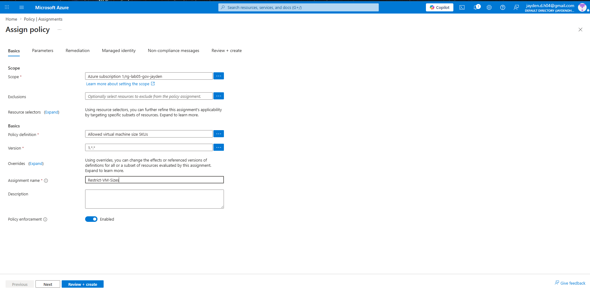
> Assign Policy blade showing the Scope set to the lab Resource Group and **"Allowed virtual machine size SKUs"** selected as the policy definition.

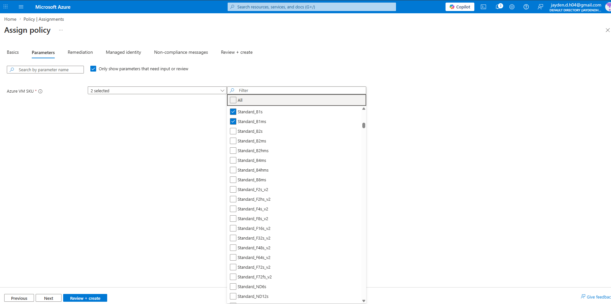
> Parameters tab with only **Standard_B1s** and **Standard_B1ms** checked under Allowed Size SKUs.

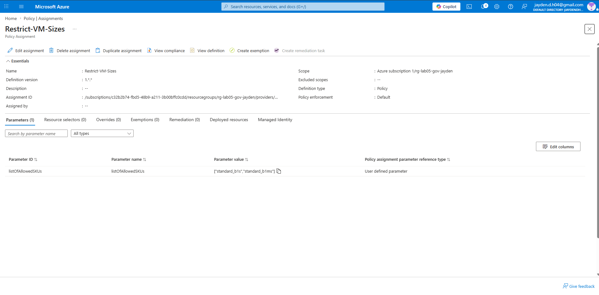
> Policy → Assignments list showing `Restrict-VM-Sizes` successfully created and active.

### Phase 5: Testing the Policy

Attempted to deploy a VM (`vm-policy-test`) using a `Standard_D2s_v3` size — deliberately outside the allowed SKU list — to confirm the policy actually enforces, not just exists on paper.

**Result:** `Validation Failed`, with the error explicitly citing `Restrict-VM-Sizes` as the blocking policy.

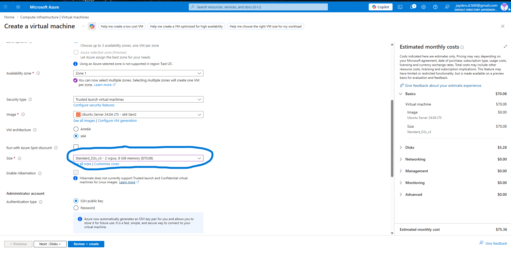
> VM creation blade showing the `vm-policy-test` name and the Size set to `Standard_D2s_v3`.

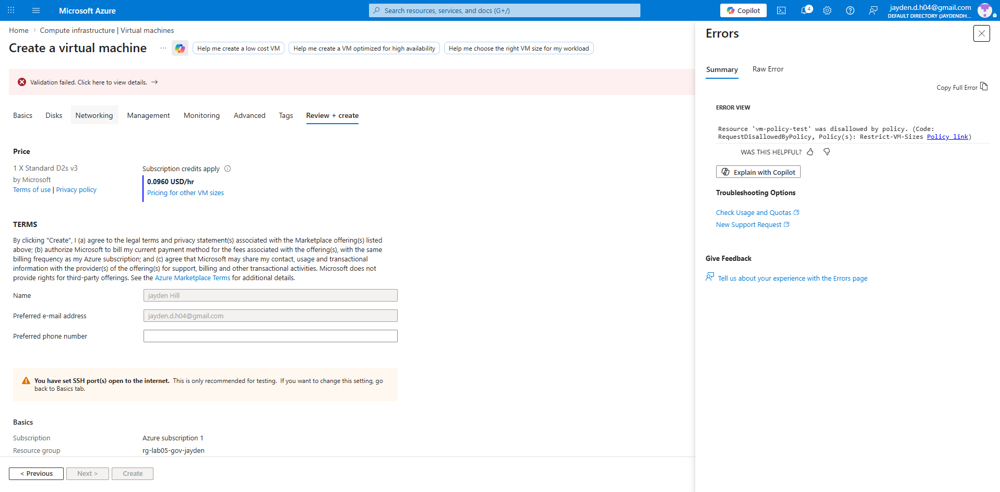
> The **Validation Failed** error screen, with the expanded error detail showing the policy name as the rejection reason. *(This is the second key proof screenshot — it shows governance-as-code blocking even an Owner-level deployment.)*

### Phase 6: Cost Management (Budgets)

Closed the loop on governance with a financial guardrail: a monthly budget with proactive alerting, so spend overruns are caught early rather than discovered on an invoice.

- **Budget name:** `Monthly-Lab-Budget`
- **Amount:** $50/month, reset on the billing month
- **Alert:** Actual spend ≥ 80% of budget → email notification

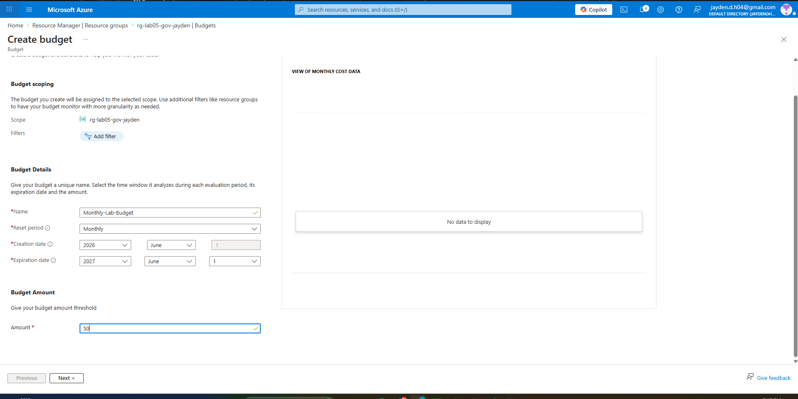
> Create Budget blade showing the name, $50 amount, and billing-month reset period.

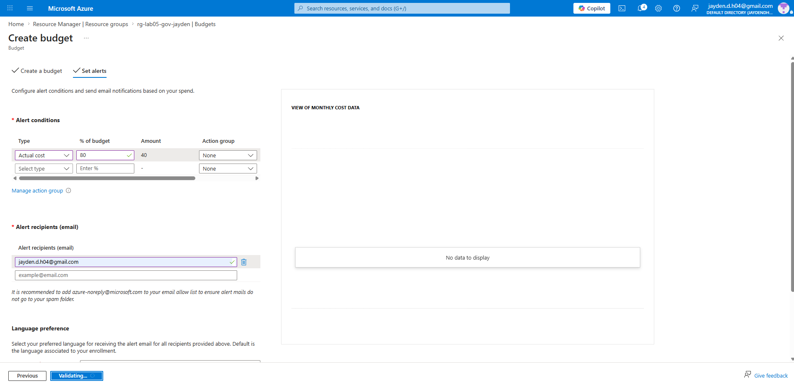
> Alert conditions screen showing Type: Actual, threshold: 80%, and the configured email recipient.

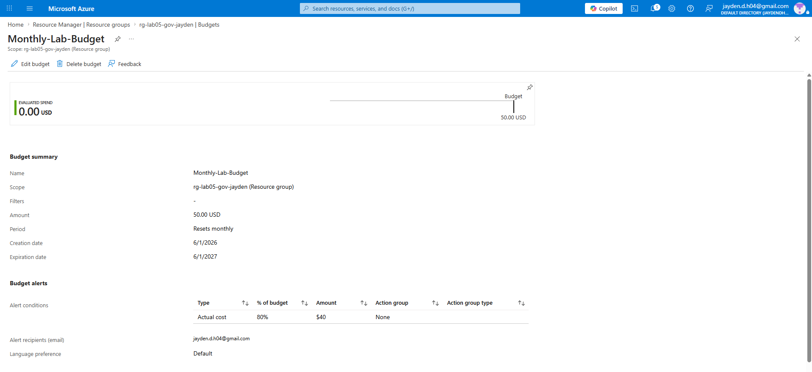
> Cost Management → Budgets overview blade listing the new budget against the Resource Group.

---

## Troubleshooting

| Issue | Resolution |
|---|---|
| Junior Dev can still create resources | Confirm the Reader role was assigned at the **Resource Group** scope, not just the subscription — and that you're testing inside the exact Resource Group the role was scoped to. |
| Policy didn't block the test VM | Azure Policy replication isn't instant. Wait 10-15 minutes after assignment and retry. |

## Cleanup

To avoid lingering costs and directory clutter after completing this lab:

1. Delete the Resource Group: `rg-lab05-gov-[yourname]`
2. Go to **Microsoft Entra ID → Users** and delete the `junior-dev-[yourname]` user

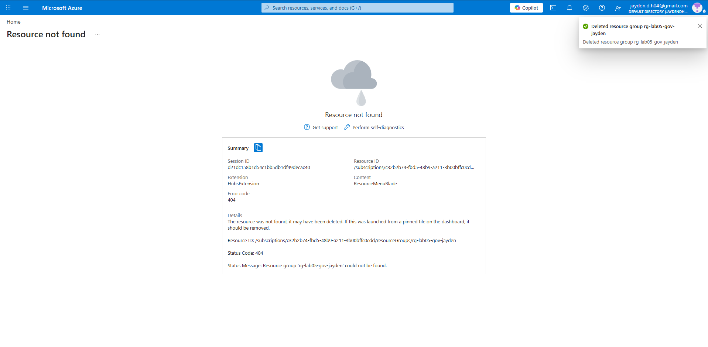
> Resource Group deletion confirmation, or the Entra ID Users list showing the junior-dev account removed.

## Skills Demonstrated

- **Identity & Access Management** — provisioning users in Microsoft Entra ID and scoping access correctly
- **Least-Privilege Access Control** — designing and validating RBAC role assignments
- **Governance-as-Code** — using Azure Policy to enforce compliance guardrails programmatically rather than relying on manual review
- **Negative Testing** — verifying controls work by deliberately trying to break them, not just trusting the configuration
- **Cloud Cost Governance (FinOps basics)** — proactive budget alerting to prevent runaway spend

## Future Enhancements

This lab was completed manually through the Azure Portal to focus on the underlying governance concepts. A natural next step for this portfolio is to **codify the same controls as Infrastructure as Code**:

- `azurerm_role_assignment` (Terraform) to manage RBAC instead of manual IAM clicks
- `azurerm_policy_definition` / `azurerm_policy_assignment` to version-control governance rules
- `azurerm_consumption_budget_resource_group` to define the cost budget declaratively
- Wrap the above in a GitHub Actions pipeline so governance changes go through PR review instead of direct portal edits
